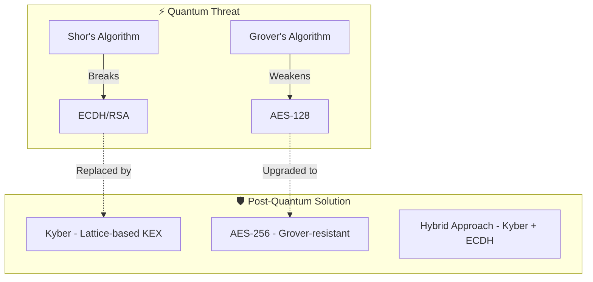
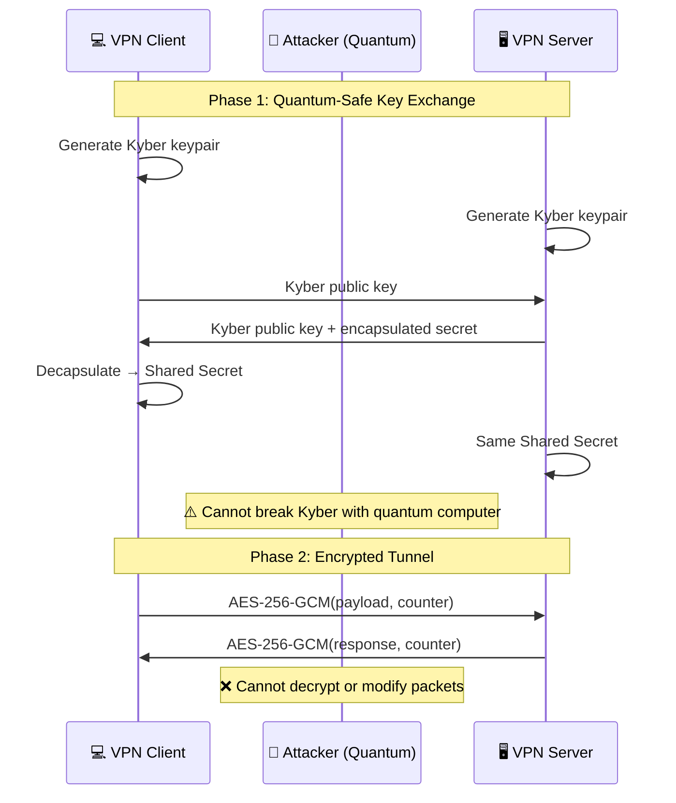
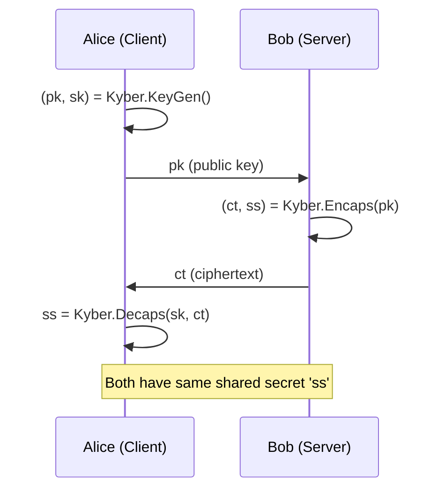
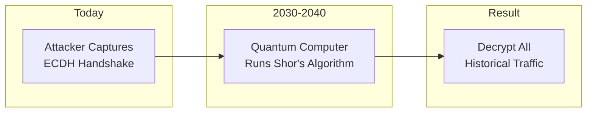

# 🔐 Quantum-Safe Tunnel VPN

A **real, working VPN** protected by **Post-Quantum Cryptography** — CRYSTALS-Kyber-768 (NIST FIPS 203, 2024) + ECDH P-384 hybrid key exchange with AES-256-GCM authenticated encryption.

> **This is not a toy.** It creates an encrypted tunnel that proxies HTTP requests (masking your IP), tunnels DNS queries (preventing ISP snooping), blocks replay/tamper attacks live, and proves its post-quantum cryptography is real. Wireshark sees only random ciphertext. nmap sees an unknown service. Every packet is authenticated.

### What Makes This a Real VPN

| VPN Capability | How Tunnel_VPN Does It | Proof |
|---|---|---|
| **Encrypted tunnel** | AES-256-GCM on every packet | Wireshark sees only random bytes |
| **IP masking** | `fetch` routes HTTP through server | httpbin.org returns server's IP, not yours |
| **DNS privacy** | `resolve` sends DNS through encrypted tunnel | ISP sees zero DNS queries |
| **Replay protection** | 64-packet sliding window | MITM demo: replayed packet → DROPPED |
| **Tamper detection** | 128-bit GCM auth tag | MITM demo: 1-bit flip → DROPPED |
| **Post-quantum crypto** | Kyber-768 (NIST FIPS 203) | `verify` returns full JSON PQC proof |
| **Bidirectional** | Server pushes data without client asking | Welcome message proves server→client |
| **Live monitoring** | Real-time web dashboard + terminal | Dashboard shows wire hex vs plaintext |
| **Attack demo** | MITM proxy with replay + tamper | Both attacks blocked, shown on dashboard |

> See **[VPN_PROOF.md](VPN_PROOF.md)** for the complete technical deep dive — byte-level packet analysis, Wireshark captures, nmap scans, and what makes this a real VPN vs. a commercial one.

---

## 📋 Table of Contents

- [Quantum Computing Relevance](#quantum-computing-relevance)
- [Architecture Overview](#architecture-overview)
- [Technology Stack](#technology-stack)
- [Project Structure](#project-structure)
- [Implementation Steps](#implementation-steps)
- [Attack Demonstrations](#attack-demonstrations)
- [Installation & Usage](#installation--usage)
- [Documentation](#documentation)

---

## 🔬 Quantum Computing Relevance



### Why This Matters for Cryptography

| Quantum Threat | Classical Algorithm | Impact | PQC Solution |
|----------------|---------------------|--------|--------------|
| Shor's Algorithm | ECDH, RSA, DSA | **Completely Broken** | Kyber (NIST Standard) |
| Grover's Algorithm | AES-128, SHA-256 | Key size effectively halved | Use AES-256, SHA-384 |

### The "Harvest Now, Decrypt Later" Attack
Adversaries are already collecting encrypted traffic today, waiting for quantum computers to decrypt it in the future. This makes post-quantum migration **urgent**.

---

## 🏗️ Architecture Overview



### Data Flow Diagram

```
CLIENT                              WIRE (attacker sees)               SERVER
┌───────────────────┐              ┌──────────────────┐              ┌───────────────────┐
│ User command:     │              │                  │              │                   │
│ "fetch url"       │              │  0x7a9c3f8b...   │              │ Decrypt → "fetch" │
│ "resolve domain"  │──AES-256──►  │  (random bytes)  │──TCP───────► │ Fetch URL / DNS   │
│ "hello world"     │   GCM        │  Can't read,     │              │ Process request   │
│                   │              │  replay, or      │              │                   │
│ Display response  │◄──AES-256──  │  tamper           │◄──TCP───────│ Encrypt response  │
│ (server's IP!)    │   GCM        │  (random bytes)  │              │ (HTTP body / IPs) │
└───────────────────┘              └──────────────────┘              └───────────────────┘
         ↕                                                                    ↕
  Kyber-768 + ECDH P-384 hybrid key exchange (quantum-safe session key)
```

---

## 🛠️ Technology Stack

| Purpose | Technology | Quantum-Safe? |
|---------|------------|---------------|
| Language | Python 3.x | - |
| **Key Exchange** | **Kyber-768 via `kyber-py` (NIST FIPS 203 / ML-KEM)** | ✅ Yes |
| Hybrid KEX | Kyber-768 + ECDH P-384 (defense in depth) | ✅ Yes |
| Encryption | AES-256-GCM | ✅ (Grover-resistant) |
| Hashing | SHA-384/SHA-256 | ✅ (256-bit security) |
| Packet Capture | Scapy | - |
| Networking | TCP Sockets | - |
| Attack Testing | Wireshark + built-in demos | - |

---

## 📁 Project Structure

```
Tunnel_VPN/
├── client/
│   └── vpn_client.py         # VPN client: tunnel commands (fetch/resolve/verify), PQC proof
├── server/
│   └── vpn_server.py         # VPN server: tunnel proxy, bidirectional push, PQC verification
├── crypto/                    # ⚡ Core Cryptography Module
│   ├── kyber_kex.py          # Real Kyber-768 KEM (NIST FIPS 203) via kyber-py
│   ├── hybrid_kex.py         # Kyber-768 + ECDH P-384 hybrid key exchange
│   ├── aes_gcm.py            # AES-256-GCM + sliding-window replay protection
│   ├── classical_kex.py      # ECDH P-384 (quantum-vulnerable, for comparison)
│   └── benchmarks.py         # Kyber vs ECDH performance benchmarks
├── attacks/                   # 🔴 Attack Demonstrations
│   ├── mitm_proxy.py         # Live MITM proxy with replay + tamper attacks
│   ├── replay_attack.py      # Standalone replay attack simulation
│   ├── tampering_demo.py     # GCM tampering detection demo
│   ├── sniffing_demo.md      # Wireshark capture guide
│   └── quantum_threat.md     # Quantum attack analysis
├── dashboard/                 # 🌐 Real-Time Web Dashboard
│   ├── app.py                # Flask SSE backend (live events, stats, API)
│   └── templates/
│       └── index.html        # Animated topology, dual wire/plaintext pane, live event log
├── docs/                      # 📚 Academic Documentation
│   ├── architecture.md       # System design
│   ├── threat_model.md       # Security analysis
│   ├── quantum_crypto.md     # PQC theory & math
│   ├── comparison.md         # Classical vs PQC
│   └── VISUAL_GUIDE.md       # Visual guide
├── tests/
│   └── test_crypto.py        # 36 unit + integration + benchmark tests
├── launch_demo.py             # One-command launcher: server + dashboard + instructions
├── run_demo.py                # Master demo runner (all crypto sections)
├── INSTRUCTIONS.md            # Step-by-step demo guide with copy-paste commands
├── VPN_PROOF.md               # Detailed proof this is a real VPN (feature-by-feature)
├── requirements.txt
└── README.md
```

---

## 📝 Implementation Steps

### 🔹 STEP 1: Capture Network Traffic

**Goal**: Understand packets using Scapy

```python
from scapy.all import sniff, IP, TCP

def packet_callback(packet):
    if IP in packet:
        print(f"Source: {packet[IP].src}")
        print(f"Destination: {packet[IP].dst}")
        print(f"Payload: {bytes(packet.payload)}")

# Capture packets
sniff(prn=packet_callback, count=10)
```

📌 At this stage: You only observe packets, no encryption yet.

---

### 🔹 STEP 2: Create Basic Tunnel (No Crypto)

**Goal**: Forward packets manually between machines

```python
import socket

# Sender
client = socket.socket(socket.AF_INET, socket.SOCK_STREAM)
client.connect(('server_ip', 5000))
client.send(payload)

# Receiver
server = socket.socket(socket.AF_INET, socket.SOCK_STREAM)
server.bind(('0.0.0.0', 5000))
server.listen(1)
conn, addr = server.accept()
data = conn.recv(4096)
```

📌 This proves: You can intercept and forward traffic.

---

### 🔹 STEP 3: Key Exchange (Crypto Core)

**Problem**: How do both sides get the same encryption key securely?

**Classical Solution (ECDH)** - ⚠️ Quantum Vulnerable:
```python
from cryptography.hazmat.primitives.asymmetric import ec
from cryptography.hazmat.primitives import hashes
from cryptography.hazmat.primitives.kdf.hkdf import HKDF

# Generate keypairs
private_key = ec.generate_private_key(ec.SECP384R1())
public_key = private_key.public_key()

# Derive shared secret
shared_key = private_key.exchange(ec.ECDH(), peer_public_key)

# Derive AES key
aes_key = HKDF(algorithm=hashes.SHA256(), length=32, ...).derive(shared_key)
```

❌ Vulnerable to Shor's Algorithm on quantum computers!

---

**Post-Quantum Solution (Kyber)** - ✅ Quantum Safe:



```python
# Using kyber-py — real CRYSTALS-Kyber768 (NIST FIPS 203)
from crypto.kyber_kex import KyberKEM

# Server generates keypair
server = KyberKEM()
server_pk, server_sk = server.generate_keypair()
# server_pk = 1,184 bytes | server_sk = 2,400 bytes

# Client encapsulates
client = KyberKEM()
ciphertext, client_shared_secret = client.encapsulate(server_pk)
# ciphertext = 1,088 bytes | shared_secret = 32 bytes

# Server decapsulates
server_shared_secret = server.decapsulate(server_sk, ciphertext)

# Both have identical 32-byte AES-256 session key!
assert client_shared_secret == server_shared_secret  # ✅ Always true
```

✔ No secret key sent over network  
✔ Secure against quantum computers  
✔ NIST standardized (ML-KEM)

---

### 🔹 STEP 4: Encrypt Packet Payloads

**Core VPN logic using AES-256-GCM**:

```python
from cryptography.hazmat.primitives.ciphers.aead import AESGCM
import os

def encrypt_packet(key: bytes, payload: bytes, counter: int) -> tuple:
    """
    Encrypt payload using AES-256-GCM
    Returns: (ciphertext, nonce, counter)
    """
    aesgcm = AESGCM(key)
    nonce = os.urandom(12)  # 96-bit nonce
    
    # Include counter in associated data for replay protection
    associated_data = counter.to_bytes(8, 'big')
    
    ciphertext = aesgcm.encrypt(nonce, payload, associated_data)
    
    return ciphertext, nonce, counter
```

📌 Only payload is encrypted (simplified VPN)

**Packet Structure**:
```
┌─────────────┬───────────┬──────────────┬────────────────┐
│ Counter (8B)│ Nonce(12B)│ Ciphertext   │ Auth Tag (16B) │
└─────────────┴───────────┴──────────────┴────────────────┘
```

---

### 🔹 STEP 5: Decrypt and Rebuild Packet

On the receiving side:

```python
def decrypt_packet(key: bytes, ciphertext: bytes, nonce: bytes, 
                   counter: int, expected_counter: int) -> bytes:
    """
    Decrypt payload using AES-256-GCM
    Raises exception on tampering or replay attack
    """
    # Replay attack protection
    if counter <= expected_counter:
        raise ReplayAttackError("Packet counter too old!")
    
    aesgcm = AESGCM(key)
    associated_data = counter.to_bytes(8, 'big')
    
    try:
        plaintext = aesgcm.decrypt(nonce, ciphertext, associated_data)
        return plaintext
    except InvalidTag:
        raise TamperingError("Packet was modified!")
```

✔ Original data restored  
✔ Tampering detected via GCM auth tag  
✔ Replay attacks rejected via counter

---

### 🔹 STEP 6: Replay Attack Protection

**Attack**: Re-sending old encrypted packets

**Solution**: Packet counter + sliding window

```python
class ReplayProtection:
    def __init__(self, window_size=64):
        self.highest_counter = 0
        self.window_size = window_size
        self.seen = set()
    
    def check(self, counter: int) -> bool:
        # Too old?
        if counter <= self.highest_counter - self.window_size:
            return False  # Reject
        
        # Already seen?
        if counter in self.seen:
            return False  # Reject
        
        # Accept and update
        self.seen.add(counter)
        if counter > self.highest_counter:
            self.highest_counter = counter
            # Clean old entries
            self.seen = {c for c in self.seen 
                        if c > self.highest_counter - self.window_size}
        return True
```

---

## 🔴 Attack Demonstrations

### Attack 1: Packet Sniffing

**Objective**: Show that encrypted payloads are unreadable

1. Start VPN tunnel
2. Open Wireshark, capture on tunnel port
3. Observe:
   - ✅ Can see packet headers
   - ❌ Cannot read encrypted payload
   - ❌ Cannot see decryption keys

```
┌──────────────────────────────────────────────────────┐
│ Wireshark Capture                                    │
├──────────────────────────────────────────────────────┤
│ No. │ Time   │ Source    │ Dest      │ Protocol     │
│ 1   │ 0.000  │ 192.168.1 │ 10.0.0.1  │ TCP          │
│                                                      │
│ Data: 7a9c3f8b2e1d5a6c8f0e2b4d6a8c0e2f... (random)  │
│       ↑ Encrypted - cannot read actual content!     │
└──────────────────────────────────────────────────────┘
```

---

### Attack 2: Packet Tampering

**Objective**: Show GCM detects modifications

```python
# attacks/tampering_demo.py

# Intercept encrypted packet
encrypted_packet = intercept()

# Flip one bit in ciphertext
tampered = bytearray(encrypted_packet)
tampered[20] ^= 0x01  # Flip bit

# Send tampered packet
send(bytes(tampered))

# Server output:
# ERROR: Authentication failed - packet was tampered!
```

**Result**: AES-GCM detects ANY modification and rejects the packet.

---

### Attack 3: Replay Attack

**Objective**: Show counter rejects re-sent packets

```python
# attacks/replay_attack.py

# Capture valid encrypted packet
captured_packet = capture()

# Wait and replay
time.sleep(5)
send(captured_packet)

# Server output:
# ERROR: Replay attack detected! Counter 42 already processed.
```

---

### Attack 4: Quantum Threat Analysis

**Why Classical VPN is Vulnerable**:



**Our Solution**: Using Kyber (lattice-based) which remains secure even against quantum computers.

---

## 🚀 Installation & Usage

### Prerequisites

```bash
# Python 3.10+ required
py -3 -m pip install kyber-py cryptography flask scapy pytest
```

### Quick Start (One Command)

```bash
# Terminal 1 — Start VPN server + live web dashboard
py -3 launch_demo.py
```

Open `http://<YOUR_LAN_IP>:8080` in any browser to see the live dashboard.

```bash
# Terminal 2 — Run automated demo (messages + DNS tunnel + HTTP tunnel + PQC verify)
py -3 client/vpn_client.py --host <YOUR_LAN_IP> --demo
```

### Interactive Mode (Tunnel Commands)

```bash
py -3 client/vpn_client.py --host <YOUR_LAN_IP>
```

| Command | What It Does |
|---|---|
| `fetch http://httpbin.org/ip` | HTTP proxy through VPN — proves IP masking |
| `resolve google.com` | DNS through VPN — proves DNS privacy |
| `verify` | Server-side Kyber-768 proof — proves PQC is real |
| `stats` | Show encryption statistics |
| `quit` | Disconnect |

### MITM Attack Demo (3 terminals)

```bash
# Terminal 1: py -3 launch_demo.py
# Terminal 2: py -3 attacks/mitm_proxy.py --target <YOUR_LAN_IP>
# Terminal 3: py -3 client/vpn_client.py --host <YOUR_LAN_IP> --port 5001 --demo
```

Watch replay and tamper attacks get blocked in real time — in all 3 terminals and the dashboard.

### Running Tests

```bash
py -3 -m pytest tests/test_crypto.py -v     # 36 tests, all should pass
```

### Other Demos

```bash
py -3 run_demo.py                  # Full interactive crypto demo (all sections)
py -3 run_demo.py --attacks        # Attack demonstrations only
py -3 run_demo.py --bench          # Performance benchmarks only
py -3 crypto/benchmarks.py         # Kyber vs ECDH latency + throughput
py -3 attacks/replay_attack.py     # Standalone replay attack
py -3 attacks/tampering_demo.py    # Standalone tamper detection
```

---

## 📚 Documentation

| Document | Description |
|----------|-------------|
| **[VPN_PROOF.md](VPN_PROOF.md)** | **Detailed proof this is a real VPN — feature-by-feature comparison** |
| **[INSTRUCTIONS.md](INSTRUCTIONS.md)** | **Step-by-step demo guide with copy-paste commands** |
| [docs/quantum_crypto.md](docs/quantum_crypto.md) | Post-Quantum Cryptography theory, Lattice-based crypto, LWE problem |
| [docs/comparison.md](docs/comparison.md) | Classical ECDH vs Kyber comparison, benchmarks |
| [docs/threat_model.md](docs/threat_model.md) | Security analysis, attack vectors, mitigations |
| [docs/architecture.md](docs/architecture.md) | System design, component diagrams |
| [attacks/quantum_threat.md](attacks/quantum_threat.md) | Quantum computing threat analysis |

---

## 🎓 Academic References

1. **NIST Post-Quantum Cryptography Standardization** - [nist.gov/pqcrypto](https://csrc.nist.gov/projects/post-quantum-cryptography)
2. **CRYSTALS-Kyber Specification** - NIST FIPS 203 (ML-KEM)
3. **Shor's Algorithm** - Polynomial-time factoring on quantum computers
4. **Grover's Algorithm** - Quadratic speedup for search problems

---

## 📄 License

This project is for educational purposes - Cryptography & Networking coursework with Quantum Computing focus.

---

<p align="center">
  <b>🔒 Securing Today's Data Against Tomorrow's Quantum Threats 🔒</b>
</p>
